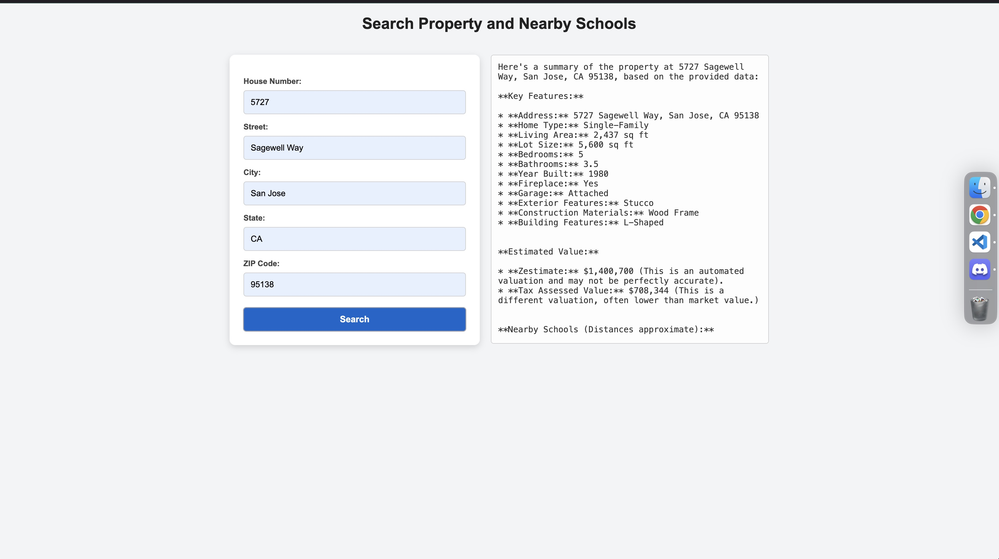
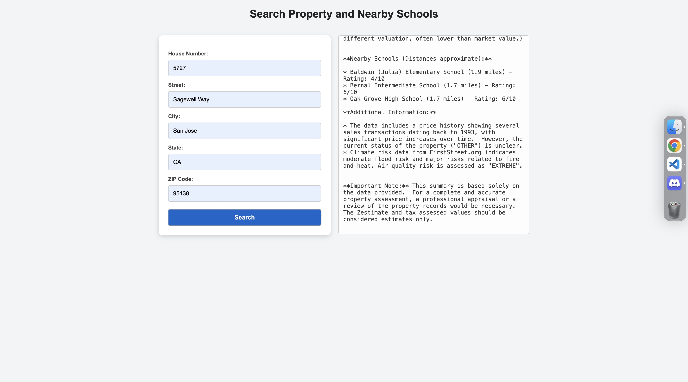

# eGain 

## Installation

### 1. Clone the Repository

git clone https://github.com/taiminhle4920/egain.git
cd egain

### 2. Create a Virtual Environment
python -m venv venv

### 3. Activate the Virtual Environment
*   Linux/Mac: source venv/bin/activate
*   Windows: venv\Scripts\activate
xx
### 4. Install Dependencies
pip install -r requirements.txt

### Configuration
Create a .env file in the root directory with the following content:
AI_API_KEY=your_google_ai_api_key
SERPAPI_KEY=your_serpapi_api_key

### Usage
#### 1. Start the Application
Run the Flask application using:

python app.py

#### 2. Access the Application
Open your browser and navigate to:
http://127.0.0.1:500

### Screenshot

### Search Results

